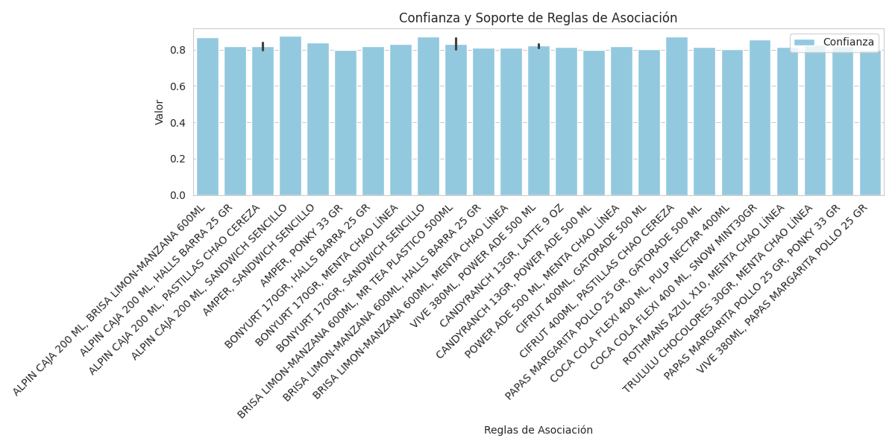
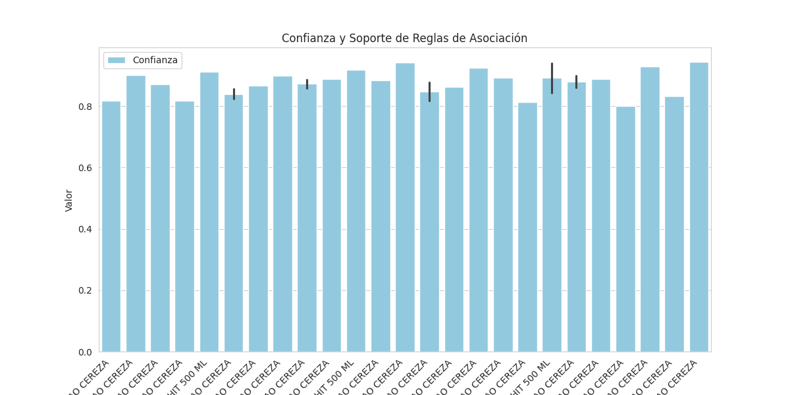
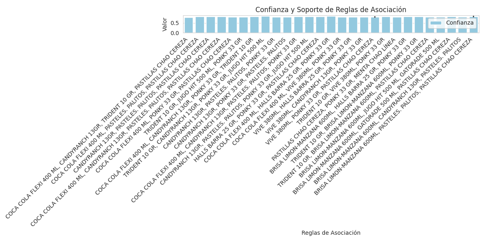
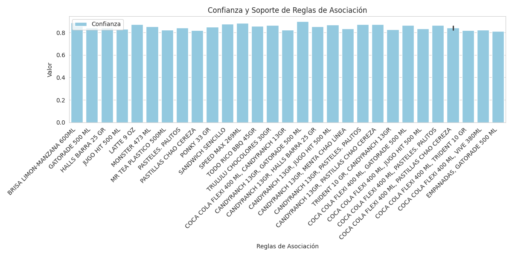
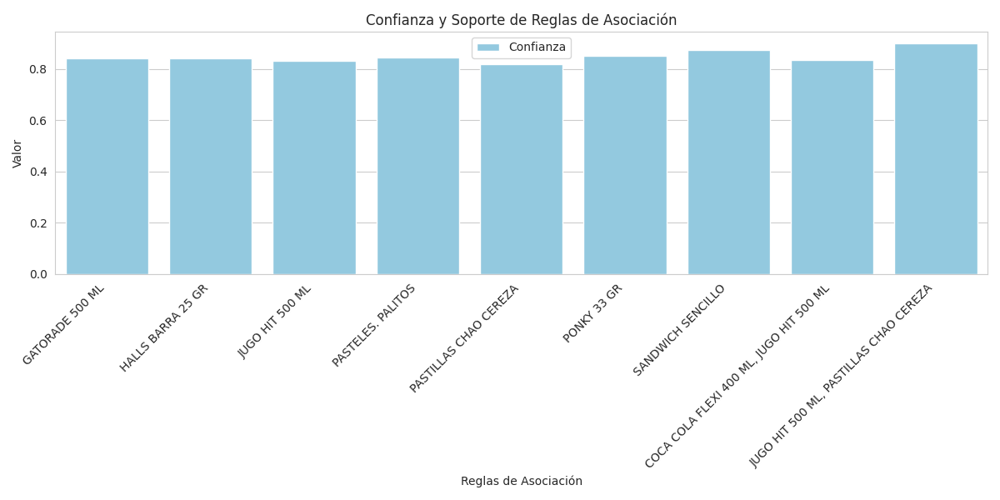

# General Information
The total registered transactions on friday was: 23,806
The total items bought on friday was: 78,760
The total amount of bills on friday was: 400
The mean of products per bill on friday was: 196.90
The max amount of products in a bill on friday was: 6,205
The total sells on friday was: 169,415,255.58
The total taxes on friday was: 25,042,875.66

## The top 10 most bought products on friday were: 
1. EMPANADAS: 1183
2. PASTELES. PALITOS: 515
3. JUGO HIT 500 ML: 429
4. COCA COLA FLEXI 400 ML: 408
5. SANDWICH SENCILLO: 343
6. TRIDENT 10 GR: 317
7. CANDYRANCH 13GR: 317
8. PASTILLAS CHAO CEREZA: 306
9. HALLS BARRA 25 GR: 270
10. MENTA CHAO LÍNEA: 266

## The top 10 least bought products on friday were: 
1. NUTRIBELA 10: 1
2. MAIZ TOSTADO 160GR: 1
3. PLANEADOR ESCRITORIO: 1
4. MALVAVISCOS ANGELITOS 50GR: 1
5. ESCENCIA VAINILLA 60ML: 1
6. COSEDORA KITTY: 1
7. CHAPSTICK SABORES: 1
8. SEDA DENTAL 20M: 1
9. ESCENCIA VUSE ORIGINAL: 1
10. VELA DEGRADE X: 1
## One of the less bought products was'MAIZ TOSTADO 160GR' and was selled with:
- EMPANADAS
- PASTELES. PALITOS
- PASTILLAS CHAO CEREZA
- JET FRESAS CON CREMA 29GR
- TODO RICO BBQ 45GR
- PROTECTORES NOSOTRAS X15
- SANDWICH SENCILLO
- NECTAR FRUTTO 300ML
- PASTELES. PALITOS
- CIFRUT 400ML
# Association Rules 
## Threshold: 0.1
|    | antecedents                              | consequents              |   antecedent support |   consequent support |   support |   confidence |    lift |   leverage |   conviction |   zhangs_metric |
|---:|:-----------------------------------------|:-------------------------|---------------------:|---------------------:|----------:|-------------:|--------:|-----------:|-------------:|----------------:|
|  0 | frozenset({'AGUA CIELO 600 ML'})         | frozenset({'EMPANADAS'}) |               0.1225 |               0.6075 |    0.115  |     0.938776 | 1.54531 |  0.0405812 |      6.41083 |        0.402143 |
|  1 | frozenset({'AGUA MANANTIAL GAS 600 ML'}) | frozenset({'EMPANADAS'}) |               0.115  |               0.6075 |    0.1    |     0.869565 | 1.43138 |  0.0301375 |      3.00917 |        0.340537 |
|  2 | frozenset({'ALPIN BOTELLA 300ML'})       | frozenset({'EMPANADAS'}) |               0.145  |               0.6075 |    0.13   |     0.896552 | 1.47581 |  0.0419125 |      3.79417 |        0.377081 |
|  3 | frozenset({'ALPIN CAJA 200 ML'})         | frozenset({'EMPANADAS'}) |               0.215  |               0.6075 |    0.1775 |     0.825581 | 1.35898 |  0.0468875 |      2.25033 |        0.336503 |
|  4 | frozenset({'BARRA TOSH 23 GR'})          | frozenset({'EMPANADAS'}) |               0.1125 |               0.6075 |    0.1    |     0.888889 | 1.46319 |  0.0316562 |      3.5325  |        0.35669  |
### K = 1
* AGUA CIELO 600 ML -> EMPANADAS
* AGUA MANANTIAL GAS 600 ML -> EMPANADAS
* ALPIN BOTELLA 300ML -> EMPANADAS

### K > 1
* ALPIN CAJA 200 ML, BRISA LIMON-MANZANA 600ML -> EMPANADAS, PASTELES. PALITOS
* ALPIN CAJA 200 ML, HALLS BARRA 25 GR -> EMPANADAS, PASTELES. PALITOS
* ALPIN CAJA 200 ML, PASTILLAS CHAO CEREZA -> EMPANADAS, JUGO HIT 500 ML
* ALPIN CAJA 200 ML, PASTILLAS CHAO CEREZA -> EMPANADAS, PASTELES. PALITOS
* ALPIN CAJA 200 ML, SANDWICH SENCILLO -> EMPANADAS, PASTELES. PALITOS

### Time elapsed apriori_execution: 1.56 seconds.
|    | antecedents                                                                | consequents                    |   antecedent support |   consequent support |   support |   confidence |    lift |   leverage |   conviction |   zhangs_metric |
|---:|:---------------------------------------------------------------------------|:-------------------------------|---------------------:|---------------------:|----------:|-------------:|--------:|-----------:|-------------:|----------------:|
|  0 | frozenset({'PASTILLAS CHAO CEREZA'})                                       | frozenset({'EMPANADAS'})       |               0.4    |               0.6075 |    0.3275 |     0.81875  | 1.34774 |  0.0845    |      2.16552 |        0.430025 |
|  1 | frozenset({'JUGO HIT 500 ML', 'PASTILLAS CHAO CEREZA'})                    | frozenset({'EMPANADAS'})       |               0.2775 |               0.6075 |    0.25   |     0.900901 | 1.48296 |  0.0814187 |      3.96068 |        0.450761 |
|  2 | frozenset({'CANDYRANCH 13GR', 'PASTILLAS CHAO CEREZA'})                    | frozenset({'EMPANADAS'})       |               0.2525 |               0.6075 |    0.22   |     0.871287 | 1.43422 |  0.0666062 |      3.04942 |        0.405024 |
|  3 | frozenset({'EMPANADAS', 'CANDYRANCH 13GR', 'PASTILLAS CHAO CEREZA'})       | frozenset({'JUGO HIT 500 ML'}) |               0.22   |               0.4725 |    0.18   |     0.818182 | 1.7316  |  0.07605   |      2.90125 |        0.541667 |
|  4 | frozenset({'PASTILLAS CHAO CEREZA', 'CANDYRANCH 13GR', 'JUGO HIT 500 ML'}) | frozenset({'EMPANADAS'})       |               0.1975 |               0.6075 |    0.18   |     0.911392 | 1.50023 |  0.0600187 |      4.42964 |        0.415498 |
### K = 1
* PASTILLAS CHAO CEREZA -> EMPANADAS
* JUGO HIT 500 ML -> EMPANADAS
* CANDYRANCH 13GR -> EMPANADAS

### K > 1
* COCA COLA FLEXI 400 ML, CANDYRANCH 13GR, TRIDENT 10 GR, PASTILLAS CHAO CEREZA -> EMPANADAS, JUGO HIT 500 ML
* COCA COLA FLEXI 400 ML, PASTELES. PALITOS, PASTILLAS CHAO CEREZA -> EMPANADAS, JUGO HIT 500 ML
* CANDYRANCH 13GR, PASTELES. PALITOS, PASTILLAS CHAO CEREZA -> EMPANADAS, JUGO HIT 500 ML
* COCA COLA FLEXI 400 ML, CANDYRANCH 13GR, PASTELES. PALITOS, PASTILLAS CHAO CEREZA -> EMPANADAS, JUGO HIT 500 ML
* COCA COLA FLEXI 400 ML, PONKY 33 GR, PASTILLAS CHAO CEREZA -> EMPANADAS, JUGO HIT 500 ML

### Time elapsed fp_growth_execution: 1.70 seconds.
## Threshold: 0.2
|    | antecedents                              | consequents              |   antecedent support |   consequent support |   support |   confidence |    lift |   leverage |   conviction |   zhangs_metric |
|---:|:-----------------------------------------|:-------------------------|---------------------:|---------------------:|----------:|-------------:|--------:|-----------:|-------------:|----------------:|
|  0 | frozenset({'BRISA LIMON-MANZANA 600ML'}) | frozenset({'EMPANADAS'}) |               0.265  |               0.6075 |    0.235  |     0.886792 | 1.45974 |  0.0740125 |      3.46708 |        0.428499 |
|  1 | frozenset({'GATORADE 500 ML'})           | frozenset({'EMPANADAS'}) |               0.3325 |               0.6075 |    0.28   |     0.842105 | 1.38618 |  0.0780062 |      2.48583 |        0.417369 |
|  2 | frozenset({'HALLS BARRA 25 GR'})         | frozenset({'EMPANADAS'}) |               0.36   |               0.6075 |    0.3025 |     0.840278 | 1.38317 |  0.0838    |      2.45739 |        0.432851 |
|  3 | frozenset({'JUGO HIT 500 ML'})           | frozenset({'EMPANADAS'}) |               0.4725 |               0.6075 |    0.3925 |     0.830688 | 1.36739 |  0.105456  |      2.3182  |        0.509343 |
|  4 | frozenset({'LATTE 9 OZ'})                | frozenset({'EMPANADAS'}) |               0.2325 |               0.6075 |    0.2025 |     0.870968 | 1.43369 |  0.0612562 |      3.04187 |        0.394137 |
### K = 1
* BRISA LIMON-MANZANA 600ML -> EMPANADAS
* GATORADE 500 ML -> EMPANADAS
* HALLS BARRA 25 GR -> EMPANADAS

### K > 1
**No results for K greater than 1.**

### Time elapsed apriori_execution: 0.84 seconds.
|    | antecedents                                                    | consequents                    |   antecedent support |   consequent support |   support |   confidence |    lift |   leverage |   conviction |   zhangs_metric |
|---:|:---------------------------------------------------------------|:-------------------------------|---------------------:|---------------------:|----------:|-------------:|--------:|-----------:|-------------:|----------------:|
|  0 | frozenset({'PASTILLAS CHAO CEREZA'})                           | frozenset({'EMPANADAS'})       |               0.4    |               0.6075 |    0.3275 |     0.81875  | 1.34774 |  0.0845    |      2.16552 |        0.430025 |
|  1 | frozenset({'JUGO HIT 500 ML', 'PASTILLAS CHAO CEREZA'})        | frozenset({'EMPANADAS'})       |               0.2775 |               0.6075 |    0.25   |     0.900901 | 1.48296 |  0.0814187 |      3.96068 |        0.450761 |
|  2 | frozenset({'CANDYRANCH 13GR', 'PASTILLAS CHAO CEREZA'})        | frozenset({'EMPANADAS'})       |               0.2525 |               0.6075 |    0.22   |     0.871287 | 1.43422 |  0.0666062 |      3.04942 |        0.405024 |
|  3 | frozenset({'COCA COLA FLEXI 400 ML', 'PASTILLAS CHAO CEREZA'}) | frozenset({'EMPANADAS'})       |               0.2425 |               0.6075 |    0.2075 |     0.85567  | 1.40851 |  0.0601812 |      2.71946 |        0.382878 |
|  4 | frozenset({'COCA COLA FLEXI 400 ML', 'PASTILLAS CHAO CEREZA'}) | frozenset({'JUGO HIT 500 ML'}) |               0.2425 |               0.4725 |    0.2    |     0.824742 | 1.74549 |  0.0854188 |      3.00985 |        0.56382  |
### K = 1
* PASTILLAS CHAO CEREZA -> EMPANADAS
* JUGO HIT 500 ML -> EMPANADAS
* CANDYRANCH 13GR -> EMPANADAS

### K > 1
**No results for K greater than 1.**

### Time elapsed fp_growth_execution: 0.92 seconds.
## Threshold: 0.25
|    | antecedents                          | consequents              |   antecedent support |   consequent support |   support |   confidence |    lift |   leverage |   conviction |   zhangs_metric |
|---:|:-------------------------------------|:-------------------------|---------------------:|---------------------:|----------:|-------------:|--------:|-----------:|-------------:|----------------:|
|  0 | frozenset({'GATORADE 500 ML'})       | frozenset({'EMPANADAS'}) |               0.3325 |               0.6075 |    0.28   |     0.842105 | 1.38618 |  0.0780062 |      2.48583 |        0.417369 |
|  1 | frozenset({'HALLS BARRA 25 GR'})     | frozenset({'EMPANADAS'}) |               0.36   |               0.6075 |    0.3025 |     0.840278 | 1.38317 |  0.0838    |      2.45739 |        0.432851 |
|  2 | frozenset({'JUGO HIT 500 ML'})       | frozenset({'EMPANADAS'}) |               0.4725 |               0.6075 |    0.3925 |     0.830688 | 1.36739 |  0.105456  |      2.3182  |        0.509343 |
|  3 | frozenset({'PASTELES. PALITOS'})     | frozenset({'EMPANADAS'}) |               0.4    |               0.6075 |    0.3375 |     0.84375  | 1.38889 |  0.0945    |      2.512   |        0.466667 |
|  4 | frozenset({'PASTILLAS CHAO CEREZA'}) | frozenset({'EMPANADAS'}) |               0.4    |               0.6075 |    0.3275 |     0.81875  | 1.34774 |  0.0845    |      2.16552 |        0.430025 |
### K = 1
* GATORADE 500 ML -> EMPANADAS
* HALLS BARRA 25 GR -> EMPANADAS
* JUGO HIT 500 ML -> EMPANADAS

### K > 1
**No results for K greater than 1.**

### Time elapsed apriori_execution: 0.57 seconds.
|    | antecedents                                              | consequents              |   antecedent support |   consequent support |   support |   confidence |    lift |   leverage |   conviction |   zhangs_metric |
|---:|:---------------------------------------------------------|:-------------------------|---------------------:|---------------------:|----------:|-------------:|--------:|-----------:|-------------:|----------------:|
|  0 | frozenset({'PASTILLAS CHAO CEREZA'})                     | frozenset({'EMPANADAS'}) |               0.4    |               0.6075 |    0.3275 |     0.81875  | 1.34774 |  0.0845    |      2.16552 |        0.430025 |
|  1 | frozenset({'JUGO HIT 500 ML', 'PASTILLAS CHAO CEREZA'})  | frozenset({'EMPANADAS'}) |               0.2775 |               0.6075 |    0.25   |     0.900901 | 1.48296 |  0.0814187 |      3.96068 |        0.450761 |
|  2 | frozenset({'PONKY 33 GR'})                               | frozenset({'EMPANADAS'}) |               0.3325 |               0.6075 |    0.2825 |     0.849624 | 1.39856 |  0.0805062 |      2.61012 |        0.426933 |
|  3 | frozenset({'JUGO HIT 500 ML'})                           | frozenset({'EMPANADAS'}) |               0.4725 |               0.6075 |    0.3925 |     0.830688 | 1.36739 |  0.105456  |      2.3182  |        0.509343 |
|  4 | frozenset({'COCA COLA FLEXI 400 ML', 'JUGO HIT 500 ML'}) | frozenset({'EMPANADAS'}) |               0.3    |               0.6075 |    0.25   |     0.833333 | 1.37174 |  0.06775   |      2.355   |        0.387143 |
### K = 1
* PASTILLAS CHAO CEREZA -> EMPANADAS
* JUGO HIT 500 ML -> EMPANADAS
* PONKY 33 GR -> EMPANADAS

### K > 1
**No results for K greater than 1.**

### Time elapsed fp_growth_execution: 0.59 seconds.
## Threshold: 0.3
|    | antecedents                          | consequents              |   antecedent support |   consequent support |   support |   confidence |    lift |   leverage |   conviction |   zhangs_metric |
|---:|:-------------------------------------|:-------------------------|---------------------:|---------------------:|----------:|-------------:|--------:|-----------:|-------------:|----------------:|
|  0 | frozenset({'HALLS BARRA 25 GR'})     | frozenset({'EMPANADAS'}) |               0.36   |               0.6075 |    0.3025 |     0.840278 | 1.38317 |   0.0838   |      2.45739 |        0.432851 |
|  1 | frozenset({'JUGO HIT 500 ML'})       | frozenset({'EMPANADAS'}) |               0.4725 |               0.6075 |    0.3925 |     0.830688 | 1.36739 |   0.105456 |      2.3182  |        0.509343 |
|  2 | frozenset({'PASTELES. PALITOS'})     | frozenset({'EMPANADAS'}) |               0.4    |               0.6075 |    0.3375 |     0.84375  | 1.38889 |   0.0945   |      2.512   |        0.466667 |
|  3 | frozenset({'PASTILLAS CHAO CEREZA'}) | frozenset({'EMPANADAS'}) |               0.4    |               0.6075 |    0.3275 |     0.81875  | 1.34774 |   0.0845   |      2.16552 |        0.430025 |
### K = 1
* HALLS BARRA 25 GR -> EMPANADAS
* JUGO HIT 500 ML -> EMPANADAS
* PASTELES. PALITOS -> EMPANADAS

### K > 1
**No results for K greater than 1.**

### Time elapsed apriori_execution: 0.57 seconds.
|    | antecedents                          | consequents              |   antecedent support |   consequent support |   support |   confidence |    lift |   leverage |   conviction |   zhangs_metric |
|---:|:-------------------------------------|:-------------------------|---------------------:|---------------------:|----------:|-------------:|--------:|-----------:|-------------:|----------------:|
|  0 | frozenset({'PASTILLAS CHAO CEREZA'}) | frozenset({'EMPANADAS'}) |               0.4    |               0.6075 |    0.3275 |     0.81875  | 1.34774 |   0.0845   |      2.16552 |        0.430025 |
|  1 | frozenset({'JUGO HIT 500 ML'})       | frozenset({'EMPANADAS'}) |               0.4725 |               0.6075 |    0.3925 |     0.830688 | 1.36739 |   0.105456 |      2.3182  |        0.509343 |
|  2 | frozenset({'PASTELES. PALITOS'})     | frozenset({'EMPANADAS'}) |               0.4    |               0.6075 |    0.3375 |     0.84375  | 1.38889 |   0.0945   |      2.512   |        0.466667 |
|  3 | frozenset({'HALLS BARRA 25 GR'})     | frozenset({'EMPANADAS'}) |               0.36   |               0.6075 |    0.3025 |     0.840278 | 1.38317 |   0.0838   |      2.45739 |        0.432851 |
### K = 1
* PASTILLAS CHAO CEREZA -> EMPANADAS
* JUGO HIT 500 ML -> EMPANADAS
* PASTELES. PALITOS -> EMPANADAS

### K > 1
**No results for K greater than 1.**

### Time elapsed fp_growth_execution: 0.52 seconds.
## Threshold: 0.35
|    | antecedents                    | consequents              |   antecedent support |   consequent support |   support |   confidence |    lift |   leverage |   conviction |   zhangs_metric |
|---:|:-------------------------------|:-------------------------|---------------------:|---------------------:|----------:|-------------:|--------:|-----------:|-------------:|----------------:|
|  0 | frozenset({'JUGO HIT 500 ML'}) | frozenset({'EMPANADAS'}) |               0.4725 |               0.6075 |    0.3925 |     0.830688 | 1.36739 |   0.105456 |       2.3182 |        0.509343 |
### K = 1
* JUGO HIT 500 ML -> EMPANADAS

### K > 1
**No results for K greater than 1.**

### Time elapsed apriori_execution: 0.48 seconds.
|    | antecedents                    | consequents              |   antecedent support |   consequent support |   support |   confidence |    lift |   leverage |   conviction |   zhangs_metric |
|---:|:-------------------------------|:-------------------------|---------------------:|---------------------:|----------:|-------------:|--------:|-----------:|-------------:|----------------:|
|  0 | frozenset({'JUGO HIT 500 ML'}) | frozenset({'EMPANADAS'}) |               0.4725 |               0.6075 |    0.3925 |     0.830688 | 1.36739 |   0.105456 |       2.3182 |        0.509343 |
### K = 1
* JUGO HIT 500 ML -> EMPANADAS

### K > 1
**No results for K greater than 1.**

### Time elapsed fp_growth_execution: 0.42 seconds.
